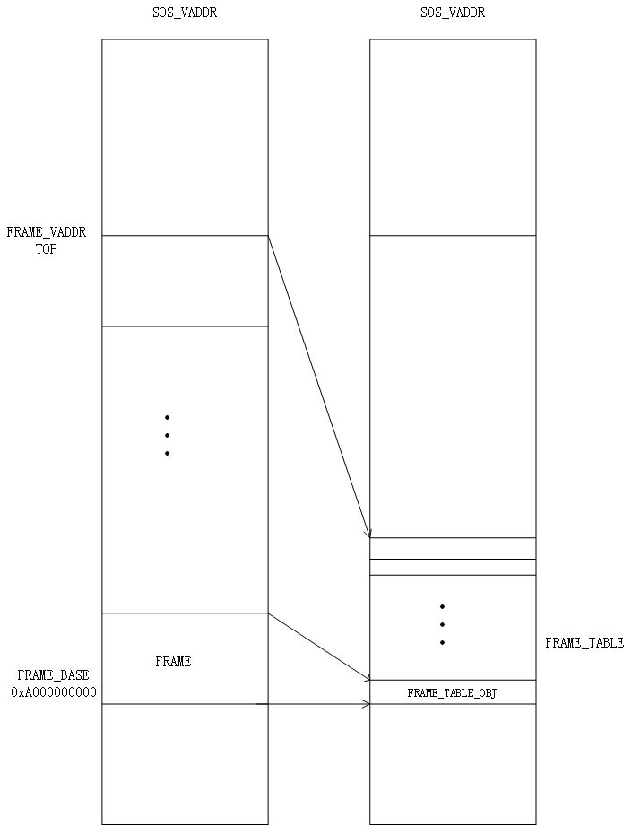
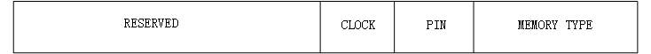
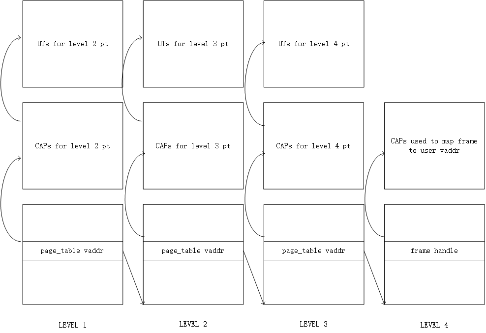

## Memory Subsystem

### Frame Table

One of the most important part of the memory subsystem is the frame table. It keeps track of allocations of all the available physical frames. In SOS, however, things are a little bit different since SOS is in essence a user level process and have no access to physical memory. Instead, what SOS keeps track of is an abstraction object called ut provided by the underlying seL4 microkernel. Since seL4 features a capability programming paradigm, the capability of ut should be keeped along with ut as well. To make later memory copying work easier, we decided to map all the frames into SOS's virtual address space. After looking at the memory map, we choose to map our frame table at the fixed virtual address 0xA000000000. Because the actual size of the physical memory could be retrieved during bootstrap, it is safe to allocate a fixed size of memory to place the frame table. Since malloc is not fully functional in SOS, we just allocate physical frame directly from seL4 to store our frame table and map that frame into SOS's virtual address space at 0xA000000000, where is high enough not to interfere with other regions since 64 bit address space is way larger than the actual pyhsical memory size.



The structure of our frame table:

```c
typedef struct frame_table_obj {
    ut_t *ut;
    int next;
    seL4_CPtr frame_cap;
    uint8_t flag;
    int pid;
    seL4_Word vaddr;
} frame_table_obj;

typedef struct frame_table {
    int free;
    int untyped;
    int num_frees;
    frame_table_obj *frames;
    int length;
    int max;
} frame_table_t;
```

To avoid linear time search the next free frame, we keep the first available frame in a global variable and in each free frame object, we keep a link pointed to the next free frame and the whole structure is to some extent like a linked list. If a frame is allocated, that link will be set to -1, indicating that that frame is not in the free frame list. Since the frame will be either in use or free, the flag will be set respectively. The first few entries of the frame table are frames used to store frame table itself and are always in use. The first available free frame comes after all these frames. To make sure there is no information leakage and the process will not crash due to junk reamaining in memory, the frame will be zeroed out before it gets allocated. 

In order to support swaping, it is necessary to keep track of the owner of the frame and the virtual address within the owner's virtual address space. Since not all frames can be swapped out, we add a pin bit in the flag. If the pin bit is set, then the frame will not be swapped out and by default, the pin bit is set when allocating and will be reset if the frame is mapped to a user process's address space. Such design will make things more simpler because frames allocated to store OS level metadata like frame table, page table, etc will never be swapped out and no further action needs to be taken. There is also a clock bit in the flag, which is used to implement seconde chance replacement algorithm. Each time swapping occurs, it will iterate through all the frames, clear the clock bit and unmap the frame. In the page fault handle, the clock bit will be set whenever the user process mapping that frame. 




### Page Table

Page table is another crital part of the memory subsystem. It keeps virtual-physical address mapping and is the most fundamental part of modern CPU architecture. Aarch64 the architecture of our processor, has a four-level page table structure, where all structures are 4K in size and use 9 bits of the virtual address.

- Page Global Directory (PGD): the top level paging structure (the root of the virtual address space).
- Page Upper Directory (PUD): the second level paging structure.
- Page Directory (PD): the third level paging structure.
- Page Table (PT): the fourth level paging structure.

All these hardware page table are maintained by the underlying seL4 and our SOS has no direct access to them. What we design is a shadow page table which keeps the virtual-frame mapping so that when a process is destroyed, we can reclaim all the memory consumed by that process. The simplest way to implement the shadow page table is to have the same structure as the underlying hardware page table. Our shadow page table is just a one-to-one mapping to the underlying hardware page table. 

* Shadow Global Directory (Shadow PGD)
* Shadow Upper Directory (Shadow PUD)
* Shadow Page Directory (Shadow PD)
* Shadow Page Table (Shadow PT)

The most challenging part of the shadow page table is that aarch64 is a 64 bit architecture but the page size is stil 4K. Since now the address will consume 8 bytes instead of 4 bytes, the nice multi-level page table with a page each level does not work any more. The reason is that each level of the page table use 9 bits of the virtual address which means there should be 512 entries in each level and the size of each entry could be 8 bytes only but the virtual address itself will use up all the 8 byte and there is no room to store physical frame. What makes the situation even tricker is that malloc is not fully functional in SOS and we have to find other ways to deal with that. There is no other choice but resort to our frame allocator to request memory. However, this approach requires us to do  housekeeping works carefully. Since what we get from the frame allocator is a ut object and a capability(slot in global cspace) of that ut object. We have to keep track of all those stuff otherwise, we will leak something and run into troubles after SOS running for a long time. To store all these objects, we need 3 frames for the first 3 level and 2 frames for the 4th level. These 3 frames is linked by the next pointer in frame_table_obj, so that we can get the 2nd and 3rd frame using the 1st frame_table_obj.




``` c
typedef struct page_table {
    seL4_Word page_obj_addr[PAGE_TABLE_SIZE];
} page_table_t;

typedef struct page_table_cap {
    seL4_Word cap[PAGE_TABLE_SIZE];
} page_table_cap;

typedef struct page_table_ut {
    ut_t *ut[PAGE_TABLE_SIZE];
} page_table_ut;
```

The structure of our page table is just a thin wrapper of the frames and at each level, these frames are allocated contiguously so that we could treat them as a huge flat array and have constant time random access.

The entry of shadow page table contains either the frame handle or the file offset of the swapping file depending on the PRESENT bit of that value. If it is present, then the vaule will be interpreted as frame handle and file offset otherwise. To let us differentiate between an empty entry and a 0 file offset, we force the file offset staring from 1 although in the actual swapping file, the offset starts from 0. 


