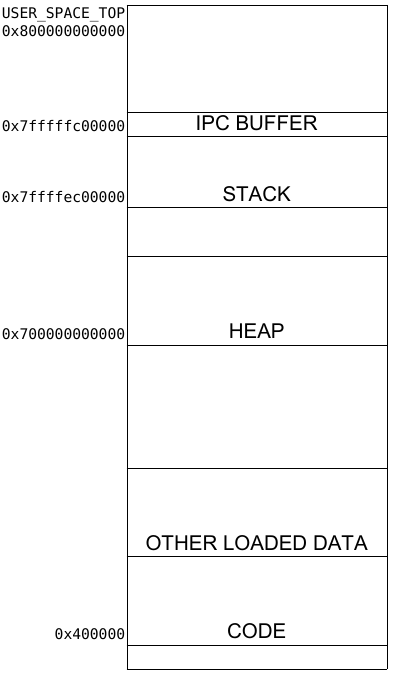

## Process Management

Like page table, SOS's PCB is just a thin wrapper of  the underlying seL4's TCB. And to make things easier, we **limit the max number of process that SOS support to 16**. By doing this, we could use a globally fixed size array to store all the PCB entry of all the process.  To prevent being intervened during kill, we define 3 state of a process. DEAD is the default value and means the entry is invalid; ACTIVE indicating that a process is valid; INACTIVE means a process is in the destroying process and should not be scheduled again. Since we support swapping, destroying a process becomes tricky because it might have to clean up its pages in the swapping file, which is a globally shared resource. Therefore, we use a **kill lock** to make sure that at any given time, there will be only one process in the destroying procedure.  Another noticeable point is how to deal with killing a process trapped in syscall. To safely stop such process, we keep track of the coroutine a process is executing in the PCB. Whenever a syscall is called, the corresponding coroutine will be stored. When a process receives a kill request, we will resume the coroutine of that process and pass an argument to tell the process that it is being killed and should not continue. In the syscall coroutine, we will always check that argument to stop the process in time. However, to deal with the callback functino in NFS, we cannot stop the process before the pending callback finishes, we will wait until the current pending callback function finishes. Since we only deal with one page in each callback, this delay will not be very long and will not block the whole kill procedure.  All process level resources a PCB keeps track of are its page table, address space and open file table. Other fileds like status, waiting_pid are just metadata of the process itself. 

```c
enum process_state {
    DEAD, ACTIVE, INACTIVE
};

typedef struct proc {
    ut_t *tcb_ut;
    seL4_CPtr tcb;
    ut_t *vspace_ut;
    seL4_CPtr vspace;
    cspace_t cspace;
    page_table_t *pt;
    addrspace *as;
    seL4_CPtr reply;
    filetable *openfile_table;
    seL4_CPtr user_endpoint;
    sos_process_t status;
    int waiting_pid;
    enum process_state state;
    struct coro *c;
} proc;
```

The memory map of a process:



**We restrict stack size to 16MB and heap size to 32MB.** Stack grows downwards from 0x7FFFFFC00000 to its max size and IPC buffer grows upwards from 0x7FFFFFC00000 to 0x800000000000. Heap grows upwards from 0x700000000000 to its max size.

