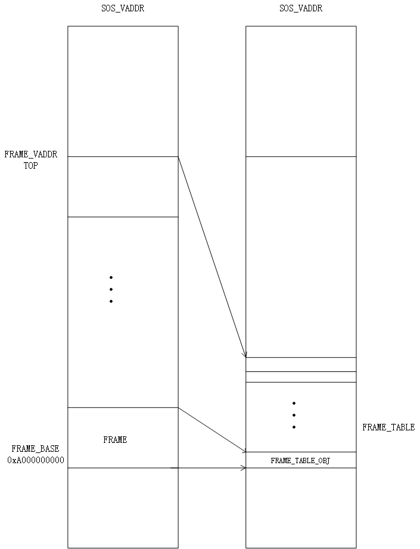

\tableofcontents

\newpage

## Execution Model

The underlying seL4 micro-kernel provides an even-based framework through which user level process could interact with it. Whenever a user level process sending a messagae through IPC endpoint to the seL4 kenel, it will be blocked until the kernel reply the message. Therefore, the process is synchronous and there is no concurrent issue if we do not add multi-thread into SOS. To keep things simple, we choose to use coroutine, keeping the event driven paradigm untouched and by doing so, we eliminate most concurrent issues if not all. For those loing runing time syscalls such as read, write, etc, we wrap them using coroutine and divide each operation into multiple phases and after each phase finish, it will yield<!-- TOC -->

## Memory Subsystem

### Frame Table

One of the most important part of the memory subsystem is the frame table. It keeps track of allocations of all the available physical frames. In SOS, however, things are a little bit different since SOS is in essence a user level process and have no access to physical memory. Instead, what SOS keeps track of is an abstraction object called ut provided by the underlying seL4 microkernel. Since seL4 features a capability programming paradigm, the capability of ut should be keeped along with ut as well. To make later memory copying work easier, we decided to map all the frames into SOS's virtual address space. After looking at the memory map, we choose to map our frame table at the fixed virtual address 0xA000000000. Because the actual size of the physical memory could be retrieved during bootstrap, it is safe to allocate a fixed size of memory to place the frame table. Since malloc is not fully functional in SOS, we just allocate physical frame directly from seL4 to store our frame table and map that frame into SOS's virtual address space at 0xA000000000, where is high enough not to interfere with other regions since 64 bit address space is way larger than the actual pyhsical memory size.

We change the include/plat/odroidc2/plat/machine/hardware.h to limit the memory view by sel4 kernel, but this would only give you about 64MB memory limitation, which would reduce the free frames to about 24MB. The amount of free frames can be set by changing MAX_MEM in frametable.h to achieve further memory limitation. It's now set at 8MB. 



The structure of our frame table:

```c
typedef struct frame_table_obj {
    ut_t *ut;
    int next;
    seL4_CPtr frame_cap;
    uint8_t flag;
    int pid;
    seL4_Word vaddr;
} frame_table_obj;

typedef struct frame_table {
    int free;
    int untyped;
    int num_frees;
    frame_table_obj *frames;
    int length;
    int max;
} frame_table_t;
```

To avoid linear time search the next free frame, we keep the first available frame in a global variable and in each free frame object, we keep a link pointed to the next free frame and the whole structure is to some extent like a linked list. If a frame is allocated, that link will be set to -1, indicating that that frame is not in the free frame list. Since the frame will be either in use or free, the flag will be set respectively. The first few entries of the frame table are frames used to store frame table itself and are always in use. The first available free frame comes after all these frames. To make sure there is no information leakage and the process will not crash due to junk reamaining in memory, the frame will be zeroed out before it gets allocated. 

In order to support swaping, it is necessary to keep track of the owner of the frame and the virtual address within the owner's virtual address space. Since not all frames can be swapped out, we add a pin bit in the flag. If the pin bit is set, then the frame will not be swapped out and by default, the pin bit is set when allocating and will be reset if the frame is mapped to a user process's address space. Such design will make things more simpler because frames allocated to store OS level metadata like frame table, page table, etc will never be swapped out and no further action needs to be taken. There is also a clock bit in the flag, which is used to implement seconde chance replacement algorithm. Each time swapping occurs, it will iterate through all the frames, clear the clock bit and unmap the frame. In the page fault handle, the clock bit will be set whenever the user process mapping that frame. 


### Page Table

Page table is another crital part of the memory subsystem. It keeps virtual-physical address mapping and is the most fundamental part of modern CPU architecture. Aarch64 the architecture of our processor, has a four-level page table structure, where all structures are 4K in size and use 9 bits of the virtual address.

- Page Global Directory (PGD): the top level paging structure (the root of the virtual address space).
- Page Upper Directory (PUD): the second level paging structure.
- Page Directory (PD): the third level paging structure.
- Page Table (PT): the fourth level paging structure.

All these hardware page table are maintained by the underlying seL4 and our SOS has no direct access to them. What we design is a shadow page table which keeps the virtual-frame mapping so that when a process is destroyed, we can reclaim all the memory consumed by that process. The simplest way to implement the shadow page table is to have the same structure as the underlying hardware page table. Our shadow page table is just a one-to-one mapping to the underlying hardware page table. 

* Shadow Global Directory (Shadow PGD)
* Shadow Upper Directory (Shadow PUD)
* Shadow Page Directory (Shadow PD)
* Shadow Page Table (Shadow PT)

The most challenging part of the shadow page table is that aarch64 is a 64 bit architecture but the page size is stil 4K. Since now the address will consume 8 bytes instead of 4 bytes, the nice multi-level page table with a page each level does not work any more. The reason is that each level of the page table use 9 bits of the virtual address which means there should be 512 entries in each level and the size of each entry could be 8 bytes only but the virtual address itself will use up all the 8 byte and there is no room to store physical frame. What makes the situation even tricker is that malloc is not fully functional in SOS and we have to find other ways to deal with that. There is no other choice but resort to our frame allocator to request memory. However, this approach requires us to do  housekeeping works carefully. Since what we get from the frame allocator is a ut object and a capability(slot in global cspace) of that ut object. We have to keep track of all those stuff otherwise, we will leak something and run into troubles after SOS running for a long time. To store all these objects, we need 3 frames for the first 3 level and 2 frames for the 4th level. These 3 frames is linked by the next pointer in frame_table_obj, so that we can get the 2nd and 3rd frame using the 1st frame_table_obj.


``` c
typedef struct page_table {
    seL4_Word page_obj_addr[PAGE_TABLE_SIZE];
} page_table_t;

typedef struct page_table_cap {
    seL4_Word cap[PAGE_TABLE_SIZE];
} page_table_cap;

typedef struct page_table_ut {
    ut_t *ut[PAGE_TABLE_SIZE];
} page_table_ut;
```

The structure of our page table is just a thin wrapper of the frames and at each level, these frames are allocated contiguously so that we could treat them as a huge flat array and have constant time random access.

The entry of shadow page table contains either the frame handle or the file offset of the swapping file depending on the PRESENT bit of that value. If it is present, then the vaule will be interpreted as frame handle and file offset otherwise. To let us differentiate between an empty entry and a 0 file offset, we force the file offset staring from 1 although in the actual swapping file, the offset starts from 0. 


\newpage

## I/O subsystem

### VFS 

To provide a uniform way to access both console and the file system, we incorporate this abstraction layer into our SOS. The VFS layer defines a bunch of operations through which the client manipulate the underlying components. We borrow most of the VFS code from OS161.

// add more details about vfs

```c
struct uio;    /* kernel or userspace I/O buffer (uio.h) */
struct device; /* abstract structure for a device (dev.h) */
struct fs;     /* abstract structure for a filesystem (fs.h) */
struct vnode;  /* abstract structure for an on-disk file (vnode.h) */
```

```c
enum uio_rw {
    UIO_READ,    /* From kernel to uio_seg */
    UIO_WRITE,   /* From uio_seg to kernel */
};

/* Source/destination. */
enum uio_seg {
    UIO_USERISPACE,    /* User process code. */
    UIO_USERSPACE,     /* User process data. */
    UIO_SYSSPACE,      /* Kernel. */
};

struct uio {
    seL4_Word vaddr;
    size_t length;              /* number of bytes to transfer   */
    size_t uio_offset;          /* Desired offset into object    */
    size_t uio_resid;           /* Remaining amt of data to xfer */
    enum uio_rw uio_rw;         /* Whether op is a read or write */
    enum uio_seg uio_segflg;
    proc *proc;
};
```

When dealing with I/O, it is inevitable to move from user level memory to kernel level memory and vice versa. To facilliate such chore, we borrow the idea of UIO from OS161. Whenever there is a syscall involved memory buffer, we use UIO to safely transfer data.  

### Console

The console is a multiple writer, single reader device and thus we have to keep track of the current process that opens the console to read. Before a process opens the console, there might be some characters coming from the serial port, so  we add a buffer to store those characters and when there is a process open the console in read mode, these character will be sent to that process. 

```c
struct con_softc {
    struct serial *serial;
    /* use for reading info */
    proc *proc;
    seL4_Word vaddr;
    unsigned cs_gotchars_head; /* next slot to put a char in   */
    unsigned cs_gotchars_tail; /* next slot to take a char out */
    size_t n;                      /* number of characters in the buffer */
    char console_buffer[BUFFER_SIZE];
    struct uio *uio;
};
```

When dealing with writing huge amounts of data to console, we use coroutine to make sure that after writing one page, it will yield back to the syscall loop to accept new incoming messages. By doing so, SOS will be reponsive even when console I/O is very busy.

### File System

The file system is actually a wrapper of the underlying NFS API. The only problem here is that the network library only supports asynchronous NFS function calls. To deal with that, we choose to use coroutine as our execution model and wrap most of the file syscalls in coroutine since using coroutine will eliminate most annoying concurrency issues and is simpler to implement. For read and write syscall, in order to make sure that SOS is responsive, we take the same approach as console I/O: read / write one page a time and yield back to syscall loop. Besides, when multiple process operates on the same file, we have to ensure atomicity of that operation. Since our execution model is coroutine and everything is under our control, an static int variable is enough to serve as a lock to protect the critical section in nfs_read and nfs_write.

Each process control block contains an open file table that keeps track of all the files opened by that process. A file can be opened by multiple processes and each of them will have an entry in their own open file table to keep track of the file offset and the mode. However, the underlying vnode will be the same across all these entries. The refcount in the entry is left to implement the posxi fork semantics although  we do not implement fork in SOS.  

```c
struct openfile {
    struct vnode *of_vnode;
    int of_accmode; /* from open: O_RDONLY, O_WRONLY, or O_RDWR */
    off_t of_offset;
    int of_refcount;
};
```

\newpage

## Process Management

Like page table, SOS's PCB is just a thin wrapper of  the underlying seL4's TCB. And to make things easier, we **limit the max number of process that SOS support to 16**. By doing this, we could use a globally fixed size array to store all the PCB entry of all the process.  To prevent being intervened during kill, we define 3 state of a process. DEAD is the default value and means the entry is invalid; ACTIVE indicating that a process is valid; INACTIVE means a process is in the destroying process and should not be scheduled again. Since we support swapping, destroying a process becomes tricky because it might have to clean up its pages in the swapping file, which is a globally shared resource. Therefore, we use a **kill lock** to make sure that at any given time, there will be only one process in the destroying procedure.  Another noticeable point is how to deal with killing a process trapped in syscall. To safely stop such process, we keep track of the coroutine a process is executing in the PCB. Whenever a syscall is called, the corresponding coroutine will be stored. When a process receives a kill request, we will resume the coroutine of that process and pass an argument to tell the process that it is being killed and should not continue. In the syscall coroutine, we will always check that argument to stop the process in time. However, to deal with the callback functino in NFS, we cannot stop the process before the pending callback finishes, we will wait until the current pending callback function finishes. Since we only deal with one page in each callback, this delay will not be very long and will not block the whole kill procedure.  All process level resources a PCB keeps track of are its page table, address space and open file table. Other fileds like status, waiting_pid are just metadata of the process itself. 

```c
enum process_state {
    DEAD, ACTIVE, INACTIVE
};

typedef struct proc {
    ut_t *tcb_ut;
    seL4_CPtr tcb;
    ut_t *vspace_ut;
    seL4_CPtr vspace;
    cspace_t cspace;
    page_table_t *pt;
    addrspace *as;
    seL4_CPtr reply;
    filetable *openfile_table;
    seL4_CPtr user_endpoint;
    sos_process_t status;
    int waiting_pid;
    enum process_state state;
    struct coro *c;
} proc;
```

The memory map of a process:


**We restrict stack size to 16MB and heap size to 32MB.** Stack grows downwards from 0x7FFFFFC00000 to its max size and IPC buffer grows upwards from 0x7FFFFFC00000 to 0x800000000000. Heap grows upwards from 0x700000000000 to its max size.

\newpage

## Swapping

Since seL4 does not provide a native support for refernece bit, in order to implement a second chance page replacement  algorithm, we have to deal with the memory reference ourselves. To achieve this, whenever swapping is triggered, we will iterate through the frame tables, unmap the frame from the page table and clear the reference bit in the frame table until we reach a frame without reference bit set. In the page fault handler, the reference bit will be set when we map a frame for the process. Besides, seL4 does not tell the type of a page fault as well. Consequently, we have to do something to help us to figure out what triggers a page fault, whether it is a page that has been swapped out, a page gets unmapped due to second chance simulating process or a page that has not been allocated yet. A present bit and unmapping bit are added in the page table, which tells us whether that page is in the swapping file or is still in memory. If the present bit is not set, then we have to load that page from swapping file. Otherwise, we only need to remap that page. 

How to manage the swapping file is another design choice and we choose to keep our design simple enough though it do have performance issue. Our swapping file is to some extent like our frame table. Its free slot is chained together and we store the next free slot inside the swapping file itself. We only store the first free slot in memory and when we need to swap a page, we have to first read the next free slot from the swapping file and replace our in-memory first free slot with this new value and then dump the page to the swpping file at the offset determined by the previous first free slot. By doing so, we do not need to keep the whole free list in memory and add more overhead to page table and frame table. However, it does slow down the swapping process. It is a tradeoff and we choose to keep it simple and easier to handle.

It is obvious that swapping file is a shared resource and we use a swp_lock to make sure at any given time, only one process will have access to the swapping file. At first glance, it seems unnecessary to add such lock since we use coroutine. However, since each time we have to write the free slot as well as the page itself. Atomicity should be preserved or the chian might get broken and in a even worse situation, load page will read some junk and crash the process. Such mechanism will also have a negative impact on the performance cause when thrahing occurs, lock contention will become severe.## Syscall 

All the syscall implemeted in SOS

```C
int sos_sys_open(const char *path, fmode_t mode);
int sos_sys_close(int file);
int sos_sys_read(int file, char *buf, size_t nbyte);
int sos_sys_write(int file, const char *buf, size_t nbyte);
int sos_getdirent(int pos, char *name, size_t nbyte);
int sos_stat(const char *path, sos_stat_t *buf);
pid_t sos_process_create(const char *path);
int sos_process_delete(pid_t pid);
pid_t sos_my_id(void);
int sos_process_status(sos_process_t *processes, unsigned max);
pid_t sos_process_wait(pid_t pid);
int64_t sos_sys_time_stamp(void);
void sos_sys_usleep(int msec);

```

Basically, most time-consuming syscalls like read, write, process_create, etc are wrapped in coroutine. When SOS receives such syscalls, it will create a coroutine resume immediately and put the coroutine into a queue. In the syscall loop, a coroutine will be poped and get resumed and if it is still resumable, it will be added to the end of the queue. By doing so, we ensure no process could monopolize the processor by issuing syscall in a high frequency.  As for those syscalls with short execution time like sos_my_id, no coroutine is used since it will not block the system.

```c
typedef struct coroutines {
    coro data;
    struct coroutines *next;
} coroutines;
```

For passing argument in syscall, we take two approaches. One is passing arguments through IPC messages. The other is through UIO. For those arguemnts having reference semantics, we use UIO to transfer between user level and kernel level. For those having value semantics, IPC is sufficient. 

SOS will dispatch the syscall depending on syscall number retrieved from IPC.

```c
void handle_syscall(seL4_Word badge, int num_args)
{
    proc *cur_proc = get_process(badge);
    seL4_CPtr reply = cspace_alloc_slot(global_cspace);
    seL4_Word syscall_number = seL4_GetMR(0);
    seL4_Error err = cspace_save_reply_cap(global_cspace, reply);
    ZF_LOGF_IFERR(err, "Failed to save reply");
    /* Process system call */
    cur_proc->reply = reply;
    switch (syscall_number) 
    case SOS_SYS_OPEN: 
    case SOS_SYS_READ: 
    case SOS_SYS_WRITE: 
    case SOS_SYS_STAT: 
    case SOS_SYS_CLOSE: 
    case SOS_SYS_GET_DIRDENTS: 
    case SOS_SYS_USLEEP:
    case SOS_SYS_TIMESTAMP:
    case SOS_SYSCALLBRK:
    case SOS_SYSCALL_MMAP:
    case SOS_SYSCALL_MUNMAP: 
    case SOS_SYS_PROCESS_CREATE: 
    case SOS_SYS_PROCESS_WAIT: 
    case SOS_SYS_PROCESS_DELETE: 
    case SOS_SYS_MY_ID: 
    case SOS_SYS_PROCESS_STATUS:
    default:
        /* don't reply to an unknown syscall */
    }
}
```

